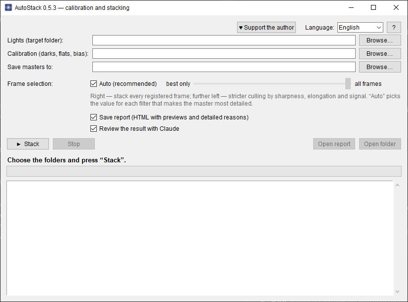

# AutoStack

**One-button calibration and stacking of astrophotos — on top of PixInsight WBPP.**
*Калибровка и сложение астрофотографий в одну кнопку — поверх PixInsight WBPP.* — [Русская версия ниже](#russian)

## Download

**[⬇ Latest version — Releases](../../releases/latest)** → `AutoStack-<version>-win64.zip`, unzip, run `AutoStack.exe`.

Windows may show “Windows protected your PC” → “More info” → “Run anyway” (the program has no paid code-signing certificate).

## Why

PixInsight's WBPP often drops some of your lights: too few stars, low SNR, unsuitable darks, the weight cut-off — and finding settings that work by hand is slow. AutoStack does it for you. The goal is to stack **all your lights, 100% where possible**, and to explain for every frame that didn't make it why and what to do about it.

Inside it runs the ordinary, unmodified WBPP — AutoStack only drives it and checks the result.

## Features

- **Matches calibration**: darks (and flats, bias) on gain, offset, temperature and exposure — not just exposure, as WBPP does. Catches darks from another camera or with another gain and explains why they don't fit.
- **Finds registration settings by itself** for each filter — from default to the most sensitive, including very star-poor fields (e.g. a galaxy in Hα) — and **verifies alignment accuracy with stars**.
- **Chooses the reference frame by itself**: the one the most frames of all filters register to.
- **Frame selection**: a slider from “best only” to “all frames”, plus **Auto**, which picks for each filter the selection that gives the most detailed master.
- Mono and colour (OSC) cameras. All masters are aligned to each other — ready for LRGB/SHO.
- **Detailed report** (HTML with previews): what went in, what didn't, why, and what to do.
- **English and Russian** interface.
- Optional **review of the result by Claude** (if Claude Code is installed; read-only).

## Requirements

- Windows
- PixInsight 1.9 with WBPP 3.x
- optional: Claude Code

## Support the author

AutoStack is free. If it helped you — **[♥ support the author via PayPal](https://www.paypal.com/donate/?business=shanvit1201%40gmail.com&no_recurring=0&item_name=AutoStack)** (the same button is in the program window).

## License

Free to use; unmodified copies of official releases may be shared. Modifying, decompiling and distributing modified versions is not allowed — see [LICENSE](LICENSE). Closed source.

PixInsight and WBPP are products of Pleiades Astrophoto S.L.; they are not included in AutoStack and are used unmodified.

---

## Русский

**AutoStack** сам калибрует и складывает ваши лайты в PixInsight. WBPP часто выбрасывает кадры (мало звёзд, низкий SNR, неподходящие дарки, отсечка по весу), а подбирать настройки вручную долго; цель AutoStack — сложить **все ваши лайты, по возможности 100%**, и по каждому кадру, который не вошёл, объяснить, почему и что с этим делать.

**[⬇ Скачать последнюю версию](../../releases/latest)** → распаковать → запустить `AutoStack.exe` (Windows может предупредить «Windows защитила компьютер» → «Подробнее» → «Выполнить в любом случае»).

- подбирает дарки/флэты по gain, offset, температуре и выдержке (ловит дарки от другой камеры)
- сам находит настройки регистрации для каждого фильтра, вплоть до полей с очень малым числом звёзд, и проверяет точность по звёздам
- сам выбирает опорный кадр, с которым совмещается больше всего кадров
- **«Отбор кадров»**: шкала от «только лучшие» до «все кадры» и режим **«Авто»**, выбирающий самый детальный мастер для каждого фильтра
- моно и цветные (OSC) камеры; все мастера выровнены друг на друга
- подробный HTML-отчёт; интерфейс на английском и русском (переключатель «Language» в окне); по желанию — проверка Claude Code (только чтение)

Нужны Windows и PixInsight 1.9 с WBPP 3.x. Программа бесплатная; **[♥ поддержать автора через PayPal](https://www.paypal.com/donate/?business=shanvit1201%40gmail.com&no_recurring=0&item_name=AutoStack)**. Исходный код закрыт, см. [LICENSE](LICENSE). PixInsight и WBPP — продукты Pleiades Astrophoto S.L.
