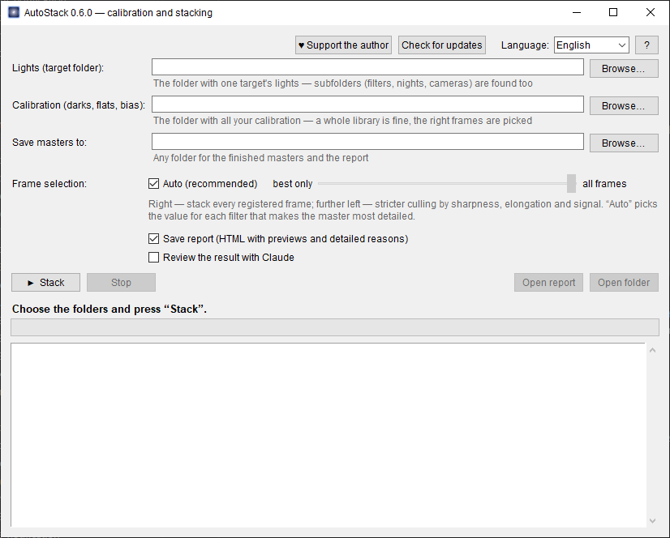

# AutoStack

**One-button calibration and stacking of astrophotos — on top of PixInsight WBPP.**

## Download

**[⬇ Latest version — Releases](../../releases/latest)** → `AutoStack-<version>-win64.zip`, unzip, run `AutoStack.exe`.

Windows may show “Windows protected your PC” → “More info” → “Run anyway” (the program has no paid code-signing certificate).

## Why

PixInsight's WBPP often drops some of your lights: too few stars, low SNR, unsuitable darks, the weight cut-off — and finding settings that work by hand is slow. AutoStack does it for you. The goal is to stack **all your lights, 100% where possible**, and to explain for every frame that didn't make it why and what to do about it.

Inside it runs the ordinary, unmodified WBPP — AutoStack only drives it and checks the result.

## Features

- **Matches calibration**: darks (and flats, bias) on camera, gain/ISO, offset, temperature and exposure — not just exposure, as WBPP does. Catches darks from another camera or with another gain and explains why they don't fit.
- **Point it at your whole calibration library — no sorting needed**: the frame type comes from the file, from the file or folder name (dark, flat, bias, offset…) or from the image itself. A dark spoiled by a light leak is noticed and left out.
- **Camera RAW files** of DSLR and mirrorless cameras (CR2, CR3, NEF, ARW, RAF, ORF, RW2, DNG…): exposure, ISO, camera and sensor temperature are read from the EXIF, darks are matched to the nearest temperature.
- **Finds registration settings by itself** for each filter — from default to the most sensitive, including very star-poor fields (e.g. a galaxy in Hα) — and **verifies alignment accuracy with stars**.
- **Picks up where it left off**: if stacking was interrupted (Stop, an error, the PC switched off), press “Stack” again with the same folders — finished steps such as calibration and registration are not redone.
- **Chooses the reference frame by itself**: the one the most frames of all filters register to.
- **Frame selection**: a slider from “best only” to “all frames”, plus **Auto**, which picks for each filter the selection that gives the most detailed master.
- Mono and colour (OSC) astro cameras **and DSLR / mirrorless cameras** (RAW: CR2, CR3, NEF, ARW, RAF, ORF, RW2, DNG…) — **even several cameras in one project** (e.g. RGB from a colour camera or a DSLR plus Hα from a mono one, or a collaboration): each camera is calibrated with its own darks/flats, and all masters come out with the same scale and rotation, ready for LRGB/SHO.
- **Detailed report** (HTML with previews): what went in, what didn't, why, and what to do.
- **English and Russian** interface.
- **Update notifications**: tells you when a new version is out, updates itself in one click and shows what changed.
- Optional **review of the result by Claude** (if Claude Code is installed; read-only; off unless you turn it on).

## Requirements

- Windows
- PixInsight 1.9 with WBPP 3.x
- optional: Claude Code

## Support the author

AutoStack is free. If it helped you — **[♥ support the author via PayPal](https://www.paypal.com/donate/?business=contact%40bluebelleweddings.com&no_recurring=0&item_name=AutoStack)** (the same button is in the program window).

## License

Free to use; unmodified copies of official releases may be shared. Modifying, decompiling and distributing modified versions is not allowed — see [LICENSE](LICENSE). Closed source.

PixInsight and WBPP are products of Pleiades Astrophoto S.L.; they are not included in AutoStack and are used unmodified.

---

# AutoStack

**Калибровка и сложение астрофотографий в одну кнопку — поверх PixInsight WBPP.**

## Скачать

**[⬇ Последняя версия — Releases](../../releases/latest)** → `AutoStack-<версия>-win64.zip`, распаковать, запустить `AutoStack.exe`.

Windows может предупредить «Windows защитила компьютер» → «Подробнее» → «Выполнить в любом случае» (у программы нет платной подписи кода).

## Зачем

WBPP в PixInsight часто выбрасывает часть лайтов: мало звёзд, низкий SNR, неподходящие дарки, отсечка по весу — а подбирать рабочие настройки вручную долго. AutoStack делает это сам. Цель — сложить **все ваши лайты, по возможности 100%**, и по каждому кадру, который не вошёл, объяснить, почему и что с этим делать.

Внутри работает обычный, неизменённый WBPP — AutoStack только управляет им и проверяет результат.

## Что умеет

- **Подбирает калибровку**: дарки (а также флэты и биасы) по камере, gain/ISO, offset, температуре и выдержке — а не только по выдержке, как WBPP. Замечает дарки от другой камеры или с другим gain и объясняет, почему они не подходят.
- **Достаточно указать всю библиотеку калибровки — раскладывать по папкам не нужно**: тип кадра берётся из файла, из имени файла или папки (dark, flat, bias, offset, дарк, флэт, оффсет…) или определяется по изображению. Дарк с засветкой замечается и не используется.
- **RAW зеркальных и беззеркальных камер** (CR2, CR3, NEF, ARW, RAF, ORF, RW2, DNG…): выдержка, ISO, камера и температура сенсора берутся из EXIF, дарки подбираются по ближайшей температуре.
- **Сам находит настройки регистрации** для каждого фильтра — от стандартных до самых чувствительных, включая поля с очень малым числом звёзд (например, галактика в Hα), — и **проверяет точность совмещения по звёздам**.
- **Продолжает с места остановки**: если сложение прервалось (Стоп, ошибка, выключился ПК), снова нажмите «Сложить» с теми же папками — уже сделанные этапы (калибровка, регистрация) не повторяются.
- **Сам выбирает опорный кадр**: тот, с которым совмещается больше всего кадров всех фильтров.
- **«Отбор кадров»**: шкала от «только лучшие» до «все кадры» и режим **«Авто»**, который для каждого фильтра выбирает отбор, дающий самый детальный мастер.
- Моно и цветные (OSC) астрокамеры, **а также зеркальные и беззеркальные камеры** (RAW: CR2, CR3, NEF, ARW, RAF, ORF, RW2, DNG…) — **даже несколько камер в одном проекте** (например, RGB с цветной камеры или зеркалки и Hα с монохромной или коллаборация): каждая камера калибруется своими дарками/флэтами, а все мастера получаются с одинаковыми масштабом и поворотом и готовы к LRGB/SHO.
- **Подробный отчёт** (HTML с превью): что вошло, что нет, почему и что делать.
- Интерфейс на **английском и русском** (переключатель «Language» в окне).
- **Уведомления об обновлениях**: сообщает о новой версии, обновляется в один клик и показывает, что изменилось.
- По желанию — **проверка результата Claude** (если установлен Claude Code; только чтение; выключена, пока вы сами её не включите).

## Что нужно

- Windows
- PixInsight 1.9 с WBPP 3.x
- по желанию: Claude Code

## Поддержать автора

Программа бесплатная. Если она вам помогла — **[♥ поддержать автора через PayPal](https://www.paypal.com/donate/?business=contact%40bluebelleweddings.com&no_recurring=0&item_name=AutoStack)** (такая же кнопка есть в окне программы).

## Лицензия

Бесплатно для использования; можно передавать неизменённые копии официальных релизов. Изменять, декомпилировать и распространять изменённые версии нельзя — см. [LICENSE](LICENSE). Исходный код закрыт.

PixInsight и WBPP — продукты Pleiades Astrophoto S.L.; они не входят в AutoStack и используются без изменений.
